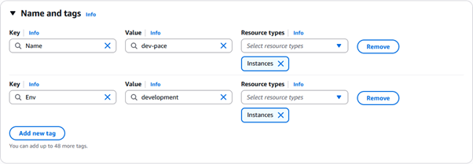
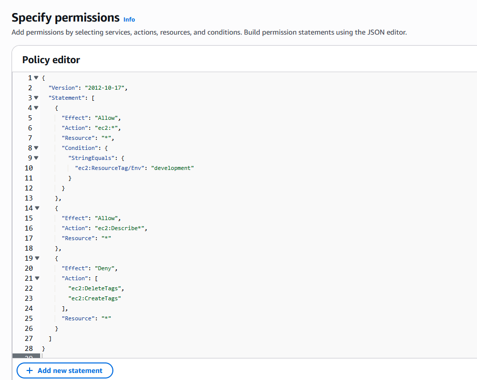
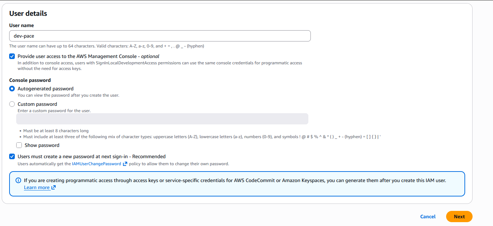
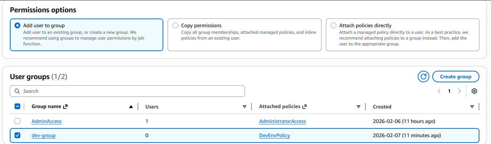
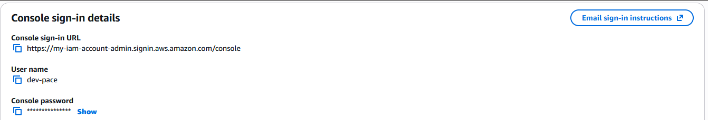
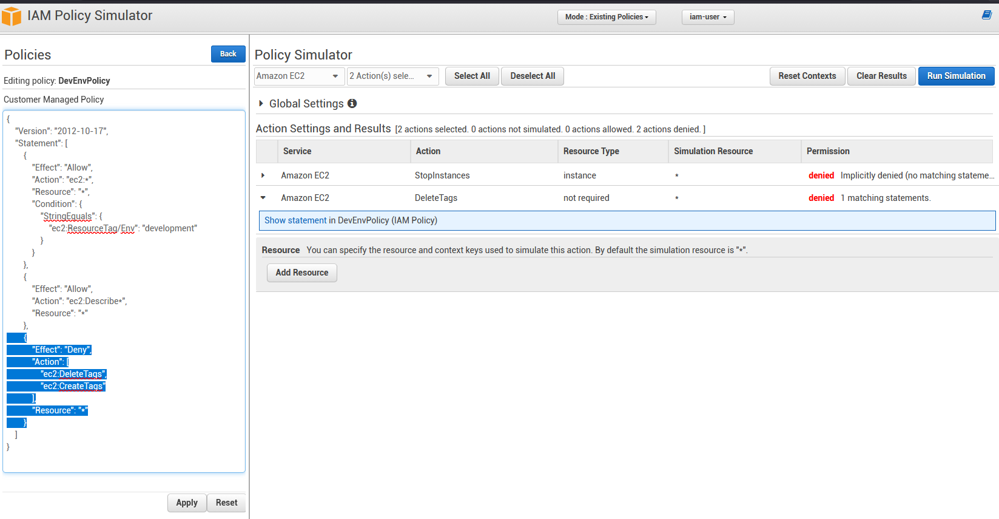
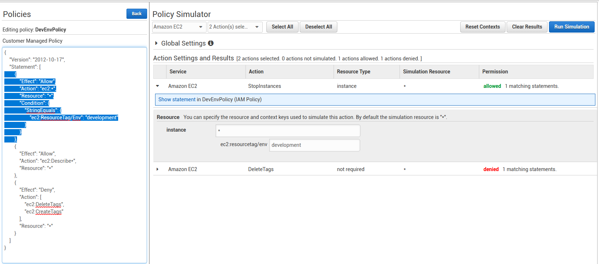

# AWS IAM Access Control Project

## Project Overview

This project demonstrates hands-on experience with AWS Identity and Access Management (IAM), focusing on implementing the principle of least privilege through custom policies, user management, and permission testing. The project simulates a real-world scenario where development and production environments require different access levels.

## Learning Objectives

This project provided practical experience with:
- Creating and managing IAM users and groups
- Designing custom IAM policies using JSON
- Implementing environment-based access control using resource tags
- Testing policies safely with IAM Policy Simulator
- Applying the principle of least privilege
- Understanding resource-level permissions in EC2

## Project Architecture

### Environment Setup

**Two EC2 Instances:**
- **Production Instance** - Tagged with `Env: production`
- **Development Instance** - Tagged with `Env: development`

**IAM Configuration:**
- Custom policy (`DevEnvPolicy`) restricting access to development resources only
- New user (`dev-pace`) assigned to the development group
- Policy tested and validated using IAM Policy Simulator

## Implementation Steps

### 1. Creating EC2 Instances with Appropriate Tags

I created two EC2 instances representing production and development environments, each tagged appropriately:



**Tags Applied:**
- Production: `Env: production`
- Development: `Env: development`

These tags are critical for the access control policy, as they determine which resources users can interact with.

### 2. Creating a Custom IAM Policy

I designed a custom policy (`DevEnvPolicy`) that implements access control:



**Policy Details:**

The policy enforces the following restrictions:

```json
{
  "Version": "2012-10-17",
  "Statement": [
    {
      "Effect": "Allow",
      "Action": "ec2:*",
      "Resource": "*",
      "Condition": {
        "StringEquals": {
          "ec2:ResourceTag/Env": "development"
        }
      }
    },
    {
      "Effect": "Allow",
      "Action": "ec2:Describe*",
      "Resource": "*"
    },
    {
      "Effect": "Deny",
      "Action": [
        "ec2:DeleteTags",
        "ec2:CreateTags"
      ],
      "Resource": "*"
    }
  ]
}
```

**Key Features:**
- **Full access** to EC2 instances tagged with `Env: development`
- **Read-only access** to all EC2 instances (via `ec2:Describe*`)
- **Explicit denial** of tag modification to prevent privilege escalation
- **No access** to production instances for destructive operations

**Security Rationale:**
Denying tag modification is crucial—without this restriction, a developer could change the `Env` tag on a production instance to "development," gaining unauthorized access.

### 3. Creating the IAM User

I created a new user named `dev-pace` to represent a developer:



**Best Practices Applied:**
- Selected "Users must create a new password at next sign-in" for enhanced security
- Provided console access for testing purposes
- Used auto-generated password to ensure strong initial credentials

### 4. Assigning the Policy

I added the `dev-pace` user to the `dev-group`, which has the `DevEnvPolicy` attached:



This demonstrates the best practice of managing permissions through groups rather than direct user attachments, making it easier to scale access management.

### 5. User Login Details

After user creation, AWS provides the necessary credentials:



These credentials allow the user to access the AWS Console and change their password on first login.

### 6. Testing with IAM Policy Simulator

Rather than logging in directly as the new user—which could be disruptive or dangerous in a real environment—I used the **IAM Policy Simulator** to validate the policy behavior.

#### Test 1: Attempting to Stop Production Instance



**Result:** **Denied** (Implicitly denied - no matching statement)

The simulator correctly shows that `dev-pace` cannot stop instances because there's no statement allowing actions on production-tagged resources.

#### Test 2: Attempting to Delete Tags



**Result:** **Denied** (1 matching statement)

The explicit `Deny` statement prevents tag modification, protecting against privilege escalation.

#### Test 3: Stopping Development Instance


**Result:** **Allowed** (1 matching statement)

The policy correctly allows `dev-pace` to perform actions on development-tagged instances.

## Conclusion

The biggest lesson was realizing how important those small details arelike preventing tag modifications—because without them the whole security model falls apart. 
